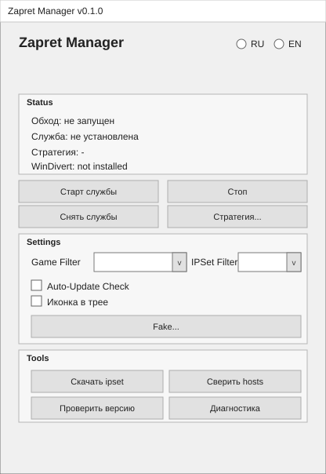
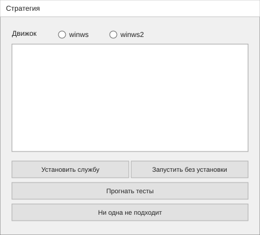
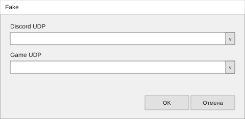
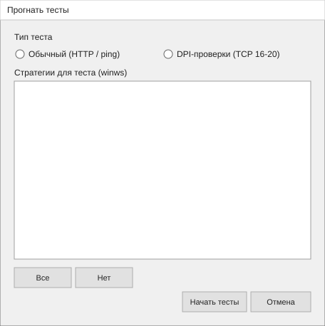
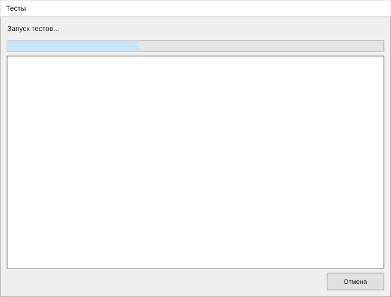
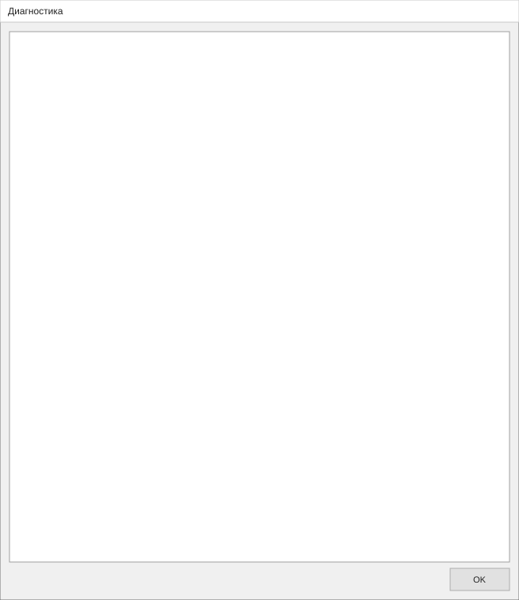
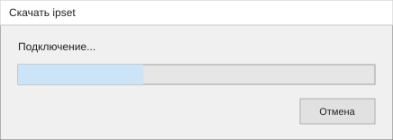
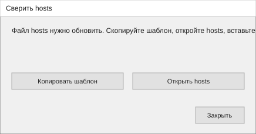
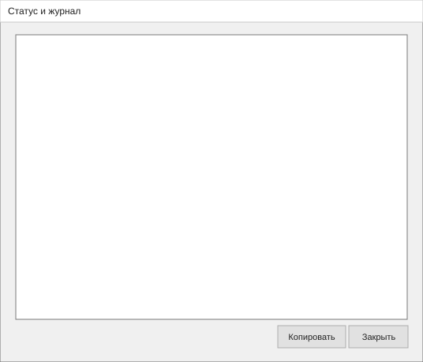

# Окна GUI

Сгенерировано [`dev/export-gui-docs.ps1`](../../dev/export-gui-docs.ps1). Файлы в этой папке не править руками.

Главное окно — образец «служба запущена». Остальные макеты в **покое**. Списки стратегий и пункты диагностики заполняет код — на тех макетах пустые рамки.

Локально: откройте [`index.html`](index.html).

## Главное

## Стратегия

## Fake

## Прогнать тесты

## Тесты

## Диагностика

## Скачать

## Сверить hosts

## Статус

